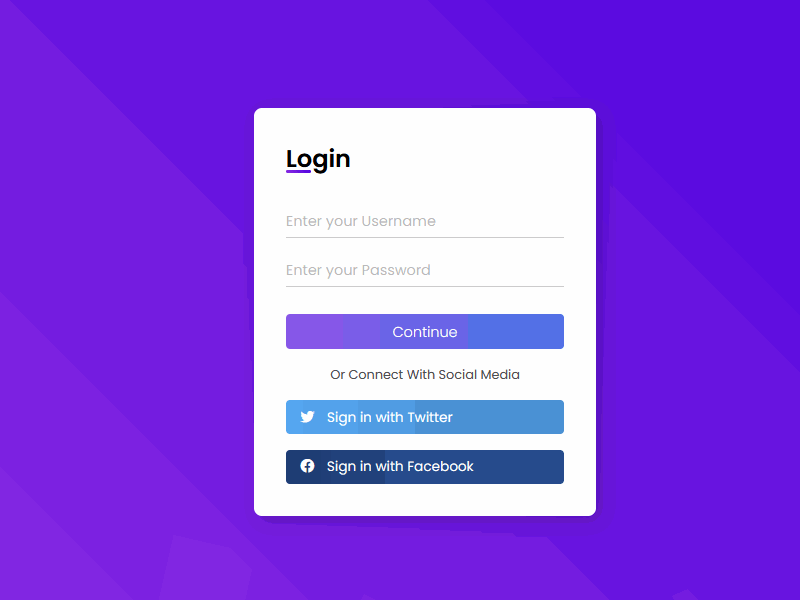

# Login_HTML_Responsivo
Criando um formulário de login responsivo com HTML e CSS com @giovannamoeller
# Como rodar o projeto
- Baixe o projeto com GIT
  ``` 
    git clone https://github.com/davidlpc1/login-form-1.git
  ```
- Baixe as dependencias com npm/yarn
  ```
    npm install
    // OR
    yarn install  
  ```

- Rode o projeto com npm/yarn
  ```
    npm run dev
    // OR
    yarn dev
  ```
- Abra o http://localhost:3000
    
    
